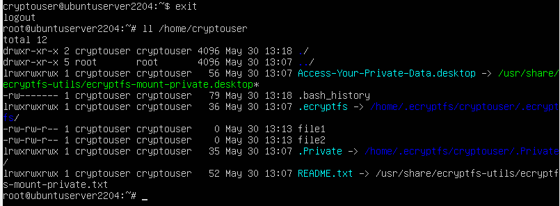

# Домашнее задание к занятию  «Защита хоста» Андрей Дёмин

### Задание 1

1. Установите **eCryptfs**.
2. Добавьте пользователя cryptouser.
3. Зашифруйте домашний каталог пользователя с помощью eCryptfs.


*В качестве ответа  пришлите снимки экрана домашнего каталога пользователя с исходными и зашифрованными данными.*  

<ins>Ответ</ins>:

Для выполнения задачи скачан и импортирован **UbuntuServer_22.04_VB_LinuxVMImages.COM.vdi**

Создан профиль пользователя:

```
sudo su - 
```
```
adduser --encrypt-home cryptouser
```


По мере выполнения задачи профиль пользователя был удален, поэтому при создании его вновь был добавлен флаг --force

```
adduser --encrypt-home --force cryptouser
```


Для возможности выполнения операций с файлами в каталоге от имени пользователя **cryptouser** ему предоставлены права:

```
chmod 755 /home/cryptouser
```


После создания файлов содержимое каталога выглядит следующим образом:


---


Содержимое файлов доступно для чтения:


Шифрование каталога **cryptouser** происходит путем его монтирования с файловой системой ecryptfs:

```
mount -t ecryptfs /home/cryptouser/ /home/cryptouser/
```


После размонтирования каталога можно увидеть содержащиеся в нем файлы, однако их содержимое зашифровано:


### Задание 2

1. Установите поддержку **LUKS**.
2. Создайте небольшой раздел, например, 100 Мб.
3. Зашифруйте созданный раздел с помощью LUKS.

*В качестве ответа пришлите снимки экрана с поэтапным выполнением задания.*

<ins>Ответ</ins>:

Для ВМ добавлен виртуальный hdd емкостью 150 Мб, установлена утилита **gparted**
```
sudo apt install gparted
```
Установлена **LUKS** :
```
sudo apt-get install cryptsetup
```
Проверка версии:
```
cryptsetup --version
```


В ходе форматирования создан mbr-раздел и выполнено монтирование файловой системы:


Создан шифрованный раздел:

```
sudo cryptsetup -y -v --type luks2 luksFormat /dev/sdb1
```


Произведено монтирование и форматирование шифрованного раздела:

```
sudo cryptsetup luksOpen /dev/sdb1 disk
```
```
sudo dd if=/dev/zero of=/dev/mapper/disk
sudo mkfs.ext4 /dev/mapper/disk
```


Создан и смонтирован каталог **.secret**

```
mkdir .secret
sudo mount /dev/mapper/disk .secret/ 
```


Содержимое каталога **.secret**


Созданы файлы:


---


После размонтирования файлы в каталоге **.secret** скрыты:

```
sudo umount .secret
sudo cryptsetup luksClose disk
```


### Задание 3 *

1. Установите **apparmor**.
2. Повторите эксперимент, указанный в лекции.
3. Отключите (удалите) apparmor.


*В качестве ответа пришлите снимки экрана с поэтапным выполнением задания.*

<ins>Ответ</ins>:

После установки **apparmor** проверен статус загруженных профилей:


В каталоге /etc/apparmor.d расположены профили **AppArmor**. Его можно использовать для управления режимом всех профилей.


Чтобы перевести все профили в режим обучения:
```
sudo aa-complain /etc/apparmor.d/*
```
Чтобы перевести все профили в защищенный режим:
```
sudo aa-enforce /etc/apparmor.d/*
```
Для запуска утилиты **ping** по команде **man** произведены следующие действия:
```
sudo cp /usr/bin/man /usr/bin/man1
sudo cp /bin/ping /usr/bin/man
sudo aa-complain /usr/bin/man
sudo man 127.0.0.1
```


После этого **apparmor** переведен в защищенный режим:
```
sudo aa-enforce man
```


Остановка сервиса **apparmor**
```
sudo service apparmor stop
```


Выгрузка профилей:
```
sudo service apparmor teardown
```


Удаление **apparmor**


